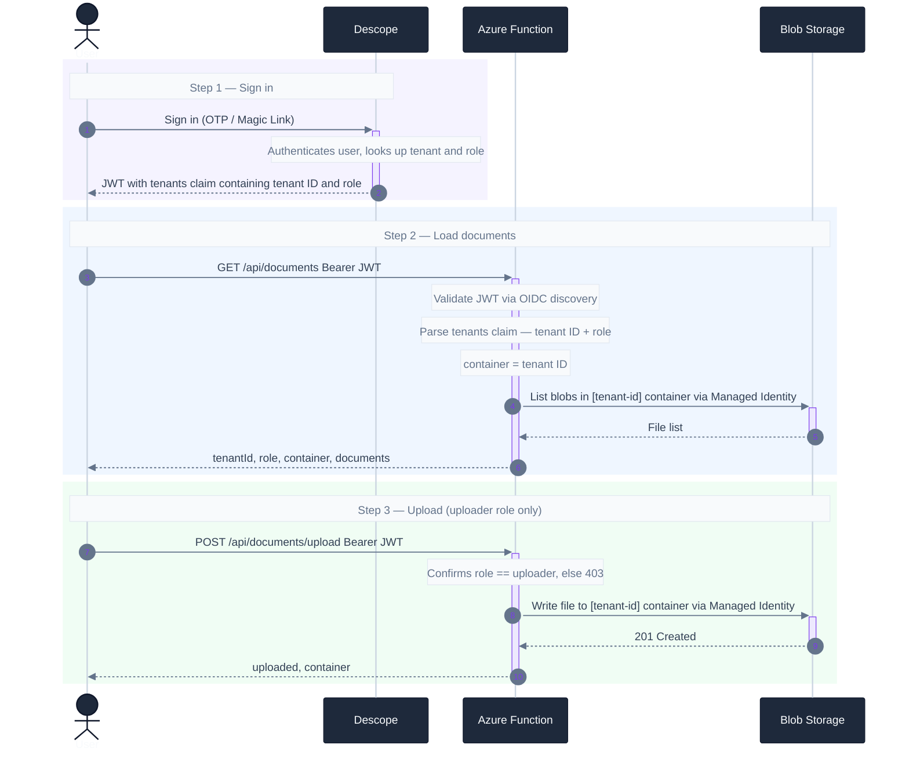

# Runtime Flow

The tenant embedded in the Descope JWT routes the user to their organization's container.
The role determines whether they can upload.

**Tenant isolation:** users only ever access their own tenant's container. The tenant ID from the JWT is used as the container name — there is no path to another tenant's data.

**Role enforcement:** viewers and uploaders in the same tenant see the same files. Only uploaders can write. The Managed Identity has Storage Blob Data Contributor on all containers; viewer write attempts are blocked at the application layer before reaching storage.

**No static secrets:** the Azure Function authenticates to Blob Storage via Managed Identity (`DefaultAzureCredential`). JWT validation uses Descope's OIDC discovery endpoint — no Descope SDK, no stored keys.
