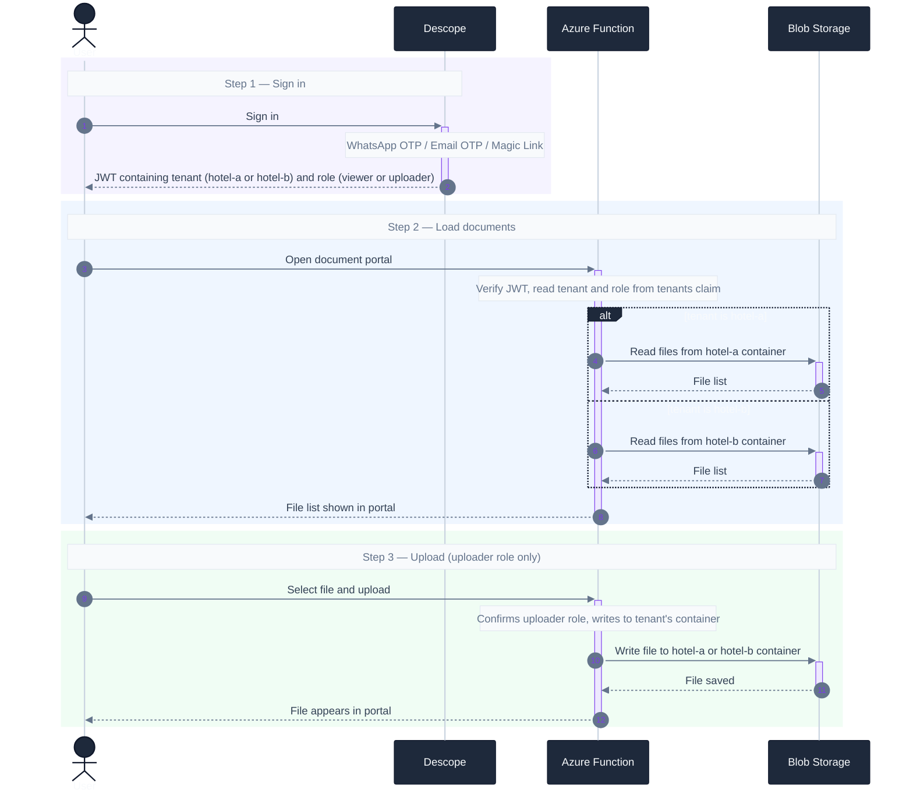
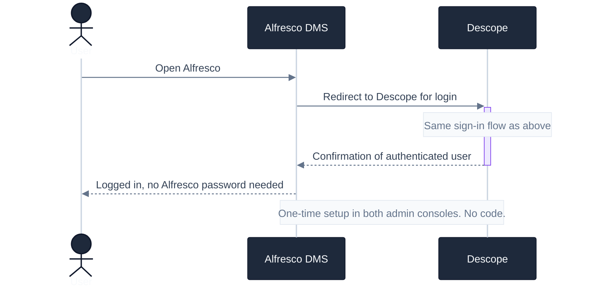

# Runtime Flow

The tenant embedded in the Descope token routes the user to their hotel's container.
The role determines whether they can upload.

## Document access

**Tenant isolation:** a Hotel A user never sees Hotel B files — the tenant in their JWT
maps to a separate Azure container and there is no path to the other.

**Role enforcement:** viewers and uploaders in the same hotel see identical documents.
Only uploaders can write. The Managed Identity has Contributor on both containers;
write access is blocked at the application layer for viewers.

## Future — Alfresco SAML SSO

