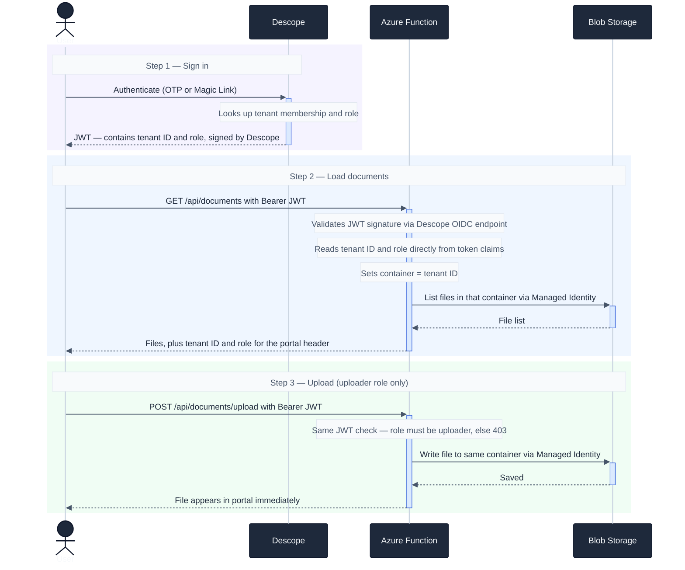

# Runtime Flow

The JWT Descope issues at sign-in carries both the tenant ID and role. The Function reads them directly from the token — no database, no extra API call.

**Tenant isolation** — each organization's files live in a separate container named after their Descope tenant ID. A user from org-a cannot access org-b's container because their JWT only contains org-a's tenant ID.

**Role enforcement** — viewers and uploaders in the same org see the same files. Write access is blocked in the Function before touching storage.

**No storage keys anywhere** — the Function talks to Blob Storage via `DefaultAzureCredential` (Managed Identity in Azure, `az login` locally). No connection strings, no SAS tokens.
