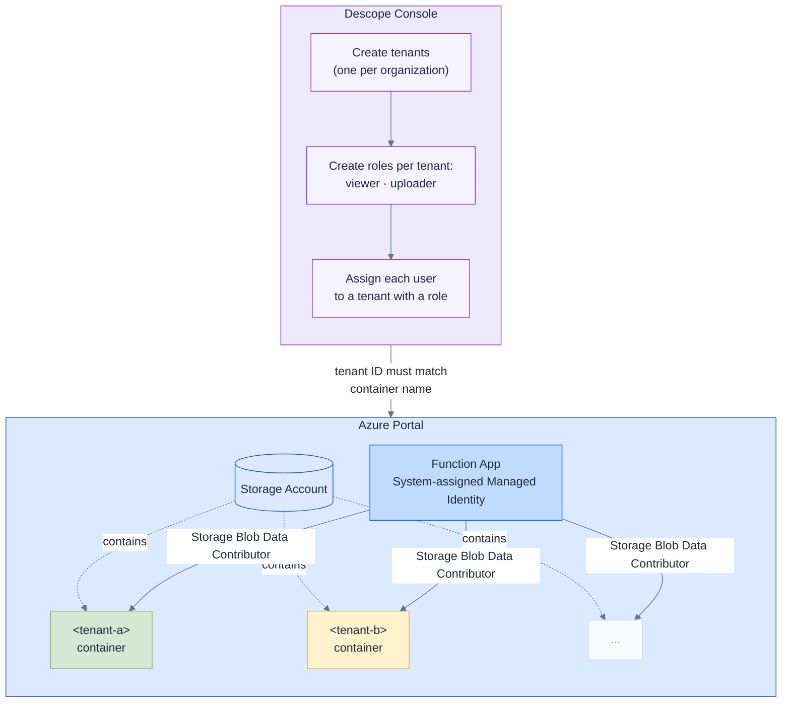

# Setup — console only, no code

Tenants and roles are configured in two places. No application code is written for either.

**Tenant** determines which Azure container a user can access — the Descope tenant ID is used directly as the container name.
**Role** determines whether the user can only read (`viewer`) or also upload (`uploader`).
