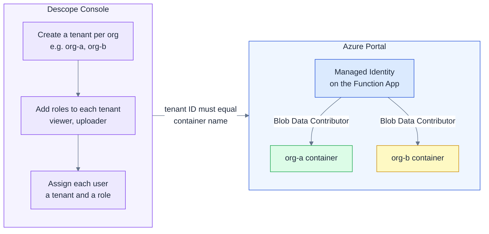

# Setup — two consoles, no code

All configuration is done in the Descope and Azure consoles. Nothing to deploy or write.

**The only coupling between Descope and Azure** is the tenant ID matching the container name. Once that's in place, the runtime is fully automatic — user role changes in Descope take effect on the next request, with no redeployment.

| What you configure | Where | Effect |
|---|---|---|
| Tenant ID | Descope Console | Determines which Azure container the user accesses |
| Role (viewer / uploader) | Descope Console | Controls whether the user can upload |
| Container name | Azure Portal | Must match the Descope tenant ID |
| Managed Identity RBAC | Azure Portal | Enforces storage-level access control |
