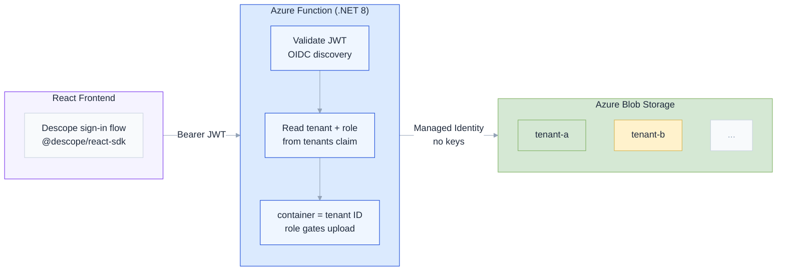
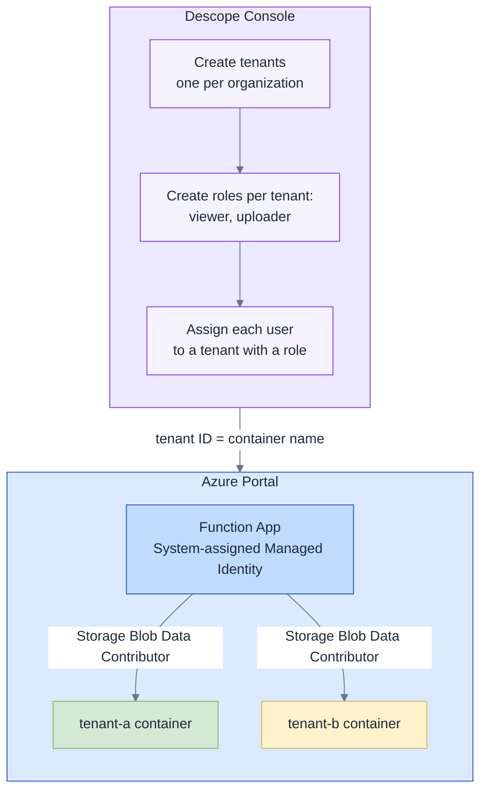
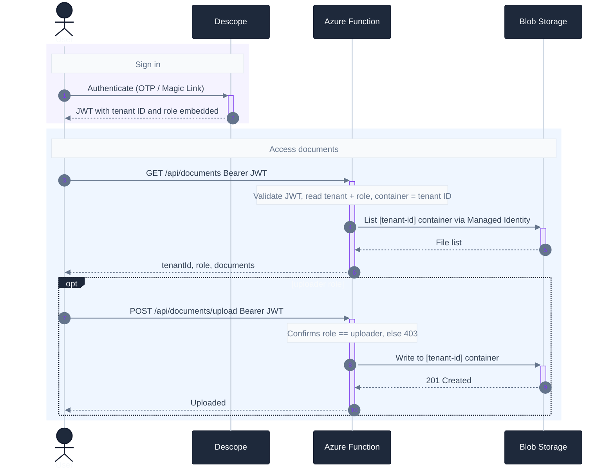

# Architecture

Multi-tenant document portal: Descope handles auth, Azure RBAC handles storage access, no custom authorization code required.

---

## Overview

---

## Setup — UI only, no code

---

## Runtime — fully automatic

