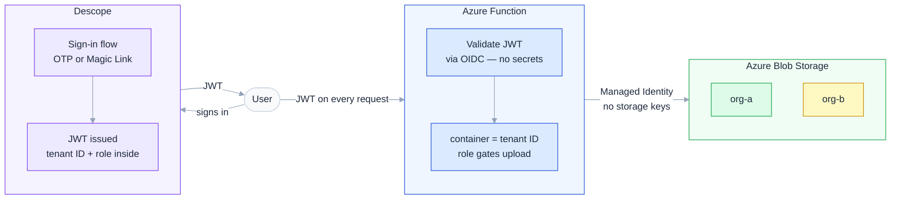
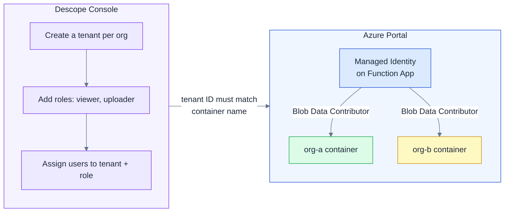
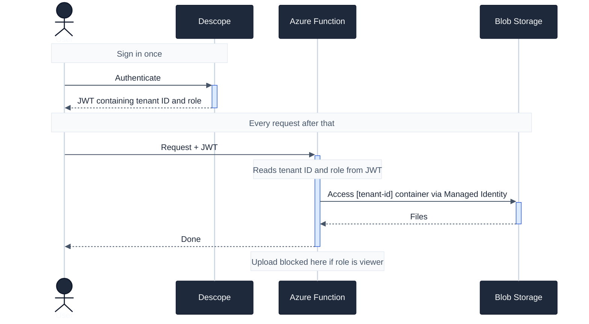

# Architecture

Three moving parts. One key insight: **the JWT carries everything the Function needs — no database, no extra config, no custom auth code.**

---

## How it works at a glance

---

## Setup — two consoles, no code

One-time configuration. Nothing to deploy.

> The Descope tenant ID and the Azure container name must match — that's the only coupling between the two systems.

---

## Runtime — sign in, then everything is automatic

